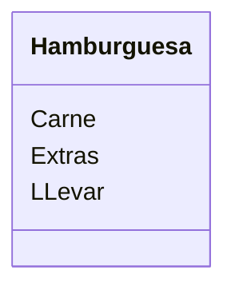

Un restaurante quiere ofrecer hamburguesas
Los clientes pueden elegir entre hamburguesa de: res, pollo
o vegetariana.
Los clientes pueden agregar extras como: lechuga, tomate, 
cebolla y mayonesa
Ademas los clientes pueden decidir comer en el restaurante 
o llevar su pedido

# Analisis

Clientes:
- Eligen el tipo de carne
- Ingredientes extras
- Deciden si llevar

Objeto
- Hamburquesa

Caracteristica
- Carne: Res, Pollo, Vegeteriana
- Extras: Lechuga, Tomate, Cebolla, Mayonesa
- Llevar

No hay metodos

