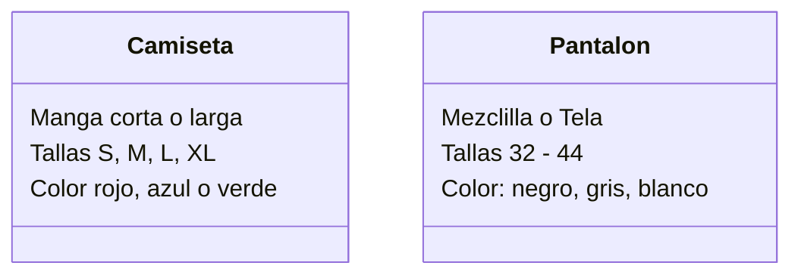

Una tienda de ropa quiere ofrecer camisetas y pantalones
Los clientes pueden elegir entre: camiseta
de manga corta o larga y pantalón de mezclilla o tela
Las camisetas pueden ser de color rojo, azul o verde
y los pantalones de color negro, gris o blanco
Las camisetas tienen las tallas: S, M, L, XL
Los pantalones tienen las tallas desde la 32 hasta la 44

# Analisis
Una tienda ofrece camisetas y pantalones.
Camiseta manga corta o larga, color (rojo, azul o verde), talla (S, M, L, XL)
Pantalon, mezclilla o tela, color (negro, gris o blanco), tallas desde 32 a 44.

Objeto
- Camiseta
- Pantalon
  
Caracteristica
- Camiseta:
  - Manga: Corta o larga.
  - Tallas: S, M, L, XL
  - Color: rojo, azul o verde
- Pantalon:
  - Mezclilla o tela
  - Tallas 32 - 44
  - Color: negro, gris, blanco
  
no hay metodos

