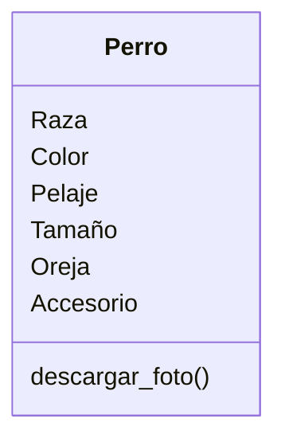

Estas diseñando una app para dibujar de perros con IA 
los usuarios pueden seleccionar características como 
la raza (por ejemplo, labrador o pastor alemán), el color 
del pelaje, el tamaño y el tipo de orejas.
Además, pueden agregar hasta dos accesorios, como sombreros 
o gafas.
El dibujo final puede descargarse en formato PNG o JPG.

# Análisis
App para dibujar perros con IA
Usuarios pueden seleccionar raza, color, pelaje, tamaño y tipo de oreja.
Pueden agregar hasta dos accesorios, sombreros y gafas, Dibujo final descargable PNG o JPG.

Objeto
- Perro

Caracteristicas
- Raza
- Color
- Pelaje
- Tamaño
- oreja
- Accesorio: sombrero y gafa

Acciones
- Descargar foto PNG O JPG

